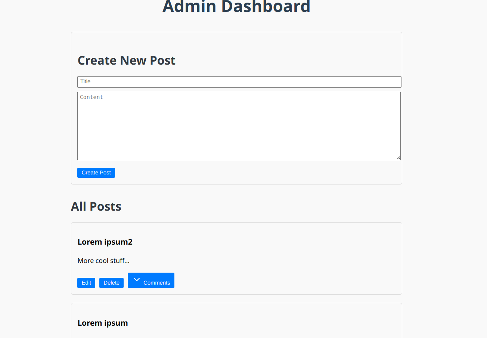

# blog-API-implementation

# Blog API Project

This project is a full-stack blog application with a React frontend and an Express backend. It allows users to view blog posts, add comments, and provides an admin interface for managing posts.

Check out here: https://blog-api-front-end--kappa.vercel.app/

## Features

- View all blog posts
- Read individual blog posts
- Add comments to blog posts
- Admin login for post management
- Create, edit, and delete: posts, comments (admin only)

### Admin Dashboard:



## Tech Stack

### Frontend
- React
- React Router dom for navigation
- Axios for API requests
- Vite as the build tool
- Deployed on Vercel

### Backend
- Node.js
- Express.js
- MongoDB with Mongoose for data storage
- JWT for authentication
- Deployed on Adaptable


### Backend
The backend is deployed on Adaptable. Make sure to set all environment variables in the Adaptable dashboard.

### Frontend
The frontend is deployed on Vercel. Ensure that the `vercel.json` file is present in the root directory with the following content:

```json
{
  "rewrites": [
    { "source": "/(.*)", "destination": "/index.html" }
  ]
}
```

This configuration is necessary for proper routing in the single-page application.

## API Endpoints

- `GET /`: Fetch all posts
- `GET /post/:id`: Fetch a specific post
- `POST /post/create`: Create a new post (protected)
- `PUT /post/:id`: Update a post (protected)
- `DELETE /post/:id`: Delete a post (protected)
- `GET /posts/:postId/comments`: Fetch comments for a post
- `POST /comment/create`: Create a new comment
- `PUT /comment/:id`: Update a comment (protected)
- `DELETE /comment/:id`: Delete a comment (protected)
- `POST /login`: Admin login
- `POST /admin`: Verify admin token